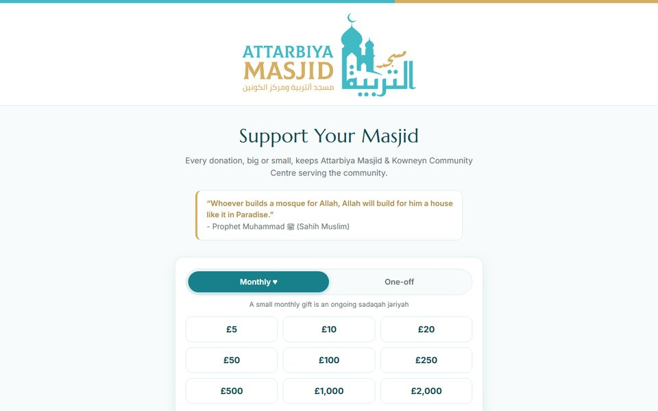

<h1 align="center">Ali Abdelatif</h1>

Computer Science graduate, University of Leeds. Based in Birmingham, UK. 
I build websites and web apps, mostly for Qur'an study and my local masjid.

  
  

## Projects

<table>
  <tr>
    <td width="33%" valign="top">
      
      <h3>Tajweed Companion</h3>
      
Short drills for each of the 45 episodes of Dr. Ayman Swaid's tajweed course, with a 127-term glossary. Works offline, with optional sign-in to sync progress between devices.

      
JavaScript · Firebase · installable web app

      
<a href="https://tajweed-companion.web.app/">Live site</a> · <a href="https://github.com/9ali-oop/tajweed-companion">Code</a>

    </td>
    <td width="33%" valign="top">
      
      <h3>Attarbiya Masjid website</h3>
      
Website for a masjid and community centre in Nechells, Birmingham. Prayer times, events and talks, with the prayer times updated daily by a scheduled GitHub Action.

      
HTML · CSS · JavaScript · GitHub Actions

      
<a href="https://9ali-oop.github.io/masjidattarbiya-website/">Live site</a> · <a href="https://github.com/9ali-oop/masjidattarbiya-website">Code</a>

    </td>
    <td width="33%" valign="top">
      
      <h3>Attarbiya donation page</h3>
      
Donation page for the same charity. One-off and monthly giving through GoCardless, in a single page with no build step and no framework.

      
HTML · CSS · JavaScript

      
<a href="https://masjidattarbiya.org/">Live site</a> · <a href="https://github.com/9ali-oop/masjid-attarbiya">Code</a>

    </td>
  </tr>
</table>

**LectureFlow** (final-year project, code private): real-time feedback for lectures. Students react to each slide, ask and upvote questions and answer quick polls. The lecturer sees the results live, and both get a report per slide afterwards. TypeScript, React, Hono, WebSockets and PostgreSQL.

## Tools

  

