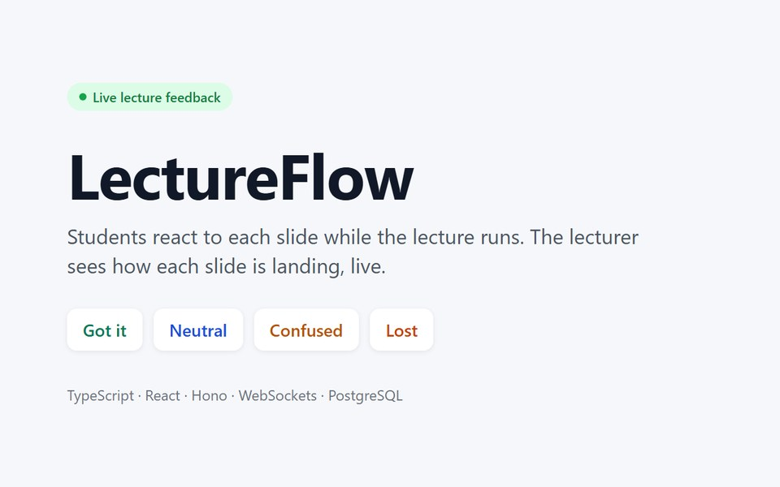
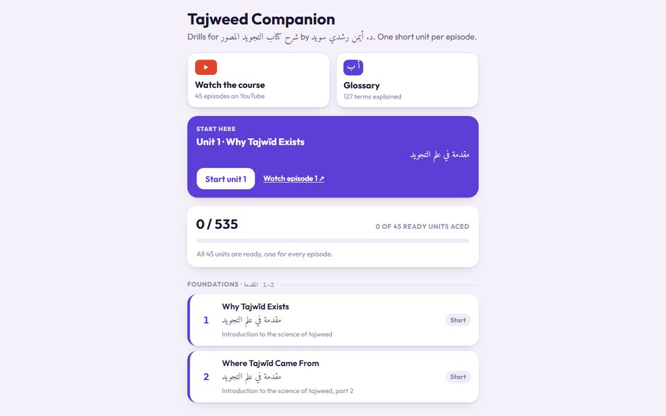
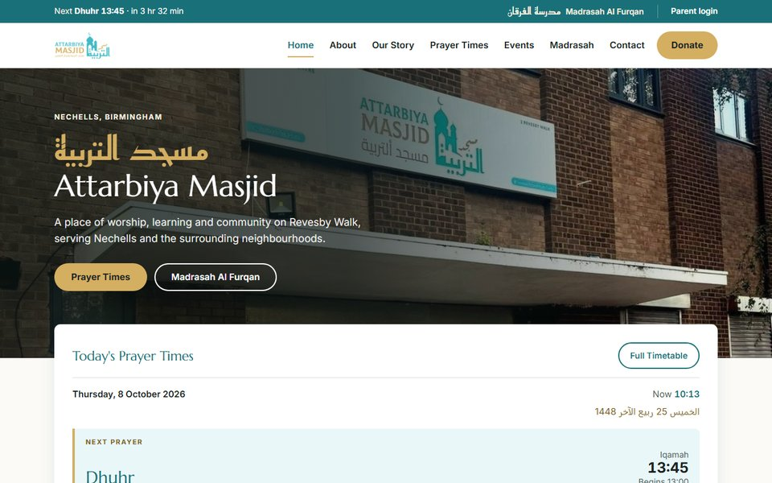

<h1 align="center">Ali Abdelatif</h1>

Computer Science graduate, University of Leeds. Based in Birmingham, UK. 
I build websites and web apps, mostly in TypeScript and JavaScript. 
Looking for graduate software engineering roles, in Birmingham or remote.

  
  

## Projects

<table>
  <tr>
    <td width="33%" valign="top">
      
      <h3>LectureFlow</h3>
      
My final-year project. Students react to each slide during a lecture, ask and upvote questions and answer quick polls. The lecturer sees it all live, and both get a per-slide report afterwards.

      
I built the WebSocket server, the lecturer and student apps, and a rules-based engine that turns the live signals into suggestions for the lecturer.

      
TypeScript · React · Hono · WebSockets · PostgreSQL

      
<a href="https://github.com/9ali-oop/lecture-feedback">Code</a>

    </td>
    <td width="33%" valign="top">
      
      <h3>Tajweed Companion</h3>
      
Short drills for each of the 45 episodes of Dr. Ayman Swaid's tajweed course, with a 127-term glossary. Works offline, with optional sign-in to sync progress between devices.

      
Every Qur'anic quotation is checked against the Uthmani text each time the site is built.

      
JavaScript · Firebase · installable web app

      
<a href="https://tajweed-companion.web.app/">Live site</a> · <a href="https://github.com/9ali-oop/tajweed-companion">Code</a>

    </td>
    <td width="33%" valign="top">
      
      <h3>Attarbiya Masjid website</h3>
      
Website for a masjid and community centre in Nechells, Birmingham: prayer times, events, the madrasah and online donations through GoCardless.

      
Prayer times update every day from Masjidbox through a scheduled GitHub Action. No framework and no build step.

      
HTML · CSS · JavaScript · GitHub Actions

      
<a href="https://masjidattarbiya.org/">Live site</a> · <a href="https://github.com/9ali-oop/masjidattarbiya-website">Code</a>

    </td>
  </tr>
</table>

## Tools

  

